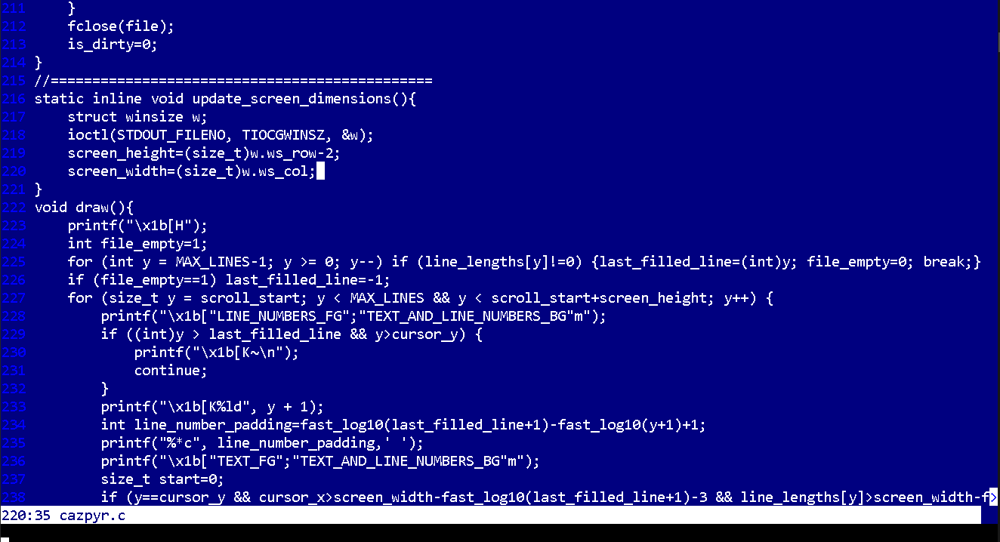
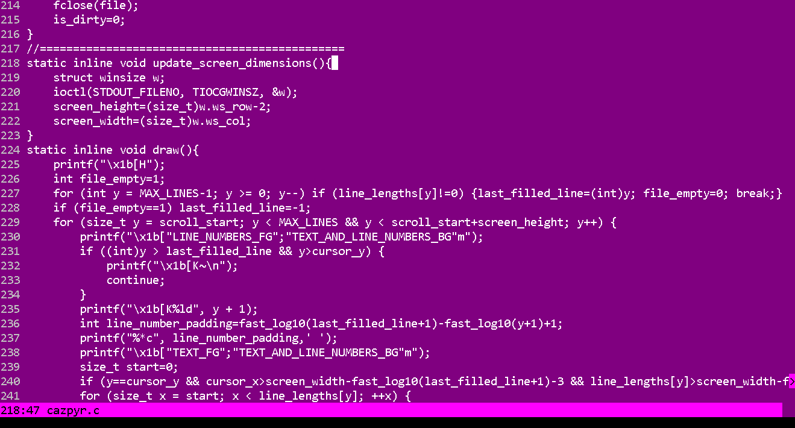
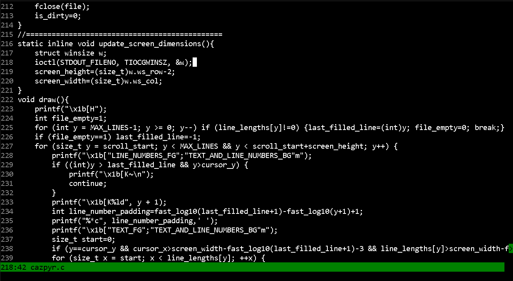
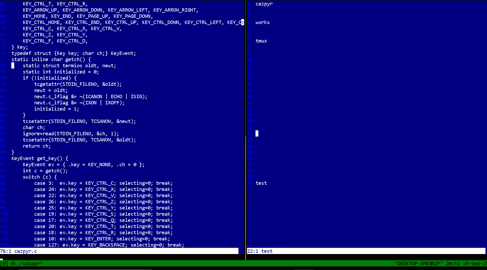

    
    <h1>CAZPYR</h1>

A heap-less minimalist terminal-based text editor written in pure C.

## Why Use CAZPYR
- **Zero heap allocations**: Predictable memory usage with fixed-size buffers
- **Fast**: No dynamic memory management overhead
- **Developer-focused**: Built-in build and run shortcuts
- **Zero dependencies**: Pure C with only standard libraries
- **Hackable**: Easy to modify codebase under 1000 lines

## Features

- Full text editing
- Cursor movement with word jumping
- Advance navigation (home, end, page up/down, file start/end, page scroll)
- Copy, cut, and paste with visual selection
- Jump to and select next instance
- Build and run shortcuts
- tmux compatible
- Line numbers with smart padding
- Auto-adapting display (responds to terminal window resizing)
- Custom ANSI color scheme (easy to modify in source)
- Fixed memory footprint (no malloc/free, no memory leaks)
- Efficient rendering (minimal screen updates)

## Keybindings

| Action | Key |
|--------|-----|
| **File Operations** |
| Save | ctrl+s |
| Quit | ctrl+q |
| **Build & Run** |
| Build | ctrl+t |
| Run | ctrl+r |
| **Navigation** |
| Move by word | ctrl + left/right arrow keys |
| Start/End of line | home/end |
| Start/End of file | ctrl+home/end |
| Page scroll | ctrl + up/down arrow keys |
| **Selection** |
| Select text | shift + navigation keys |
| **Editing** |
| Copy | ctrl+c |
| Cut | ctrl+x |
| Paste | ctrl+v |
| **Find** |
| Select into find | ctrl+f |
| Select next instance of find | ctrl+d |

## Screenshots

## Todo

- Undo and redo
- Syntax Highlighting
